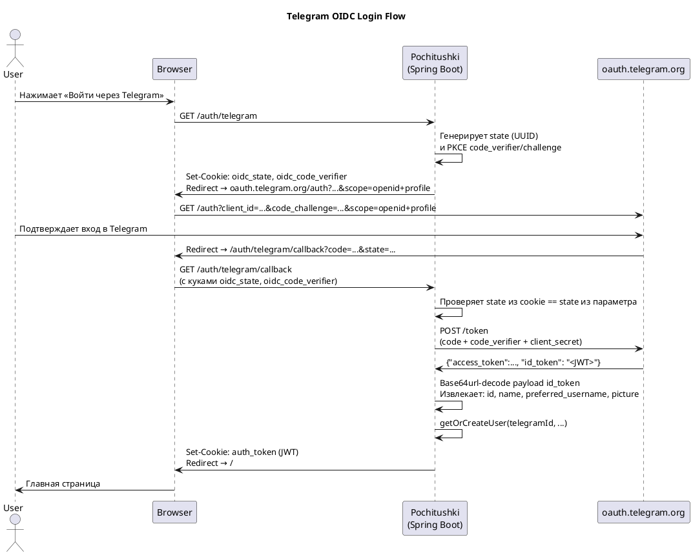
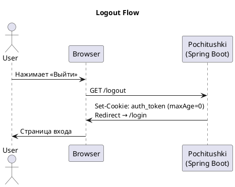
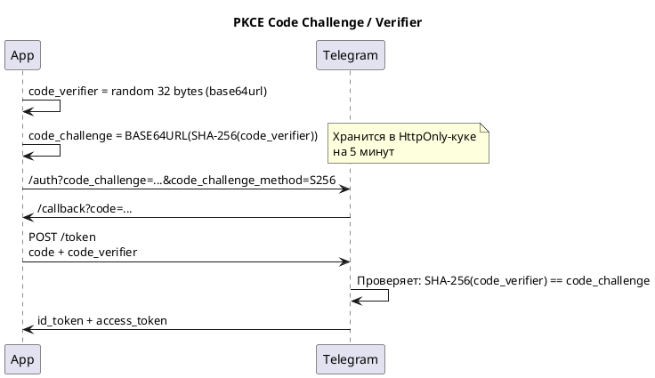

# Pochitushki Service

Сервис представляет собой Telegram-бота для сохранения и управления ссылками, аналог сервисов "отложенного чтения" (read-it-later), таких как Pocket.

## Основные возможности

- **Сохранение ссылок**: Просто отправьте боту ссылку, и он сохранит ее.
- **Просмотр сохраненных ссылок**: Получайте список ваших сс��лок в виде ленты.
- **Архивация**: Архивируйте посты, которые вы уже просмотрели, и возвращайте их из архива при необходимости.
- **Удаление**: Удаляйте ненужные ссылки.
- **Случайная ссылка**: Получите случайную ссылку из вашего списка для чтения.
- **Импорт из Pocket**: Загрузите ZIP-архив с вашими данными из Pocket для импорта всех ссылок.
- **Экспорт**: Экспортируйте ваши данные.

## Аутентификация через Telegram (OIDC + PKCE)

Веб-интерфейс использует Telegram Login через стандартный OAuth 2.0 / OIDC Authorization Code Flow с PKCE.
Данные пользователя извлекаются из `id_token` JWT — отдельного UserInfo-endpoint у Telegram нет.

### Общий флоу входа



### Структура id_token

Telegram возвращает JWT со следующими claim'ами (при scope `openid profile`):

| Claim | Тип | Описание |
|---|---|---|
| `id` | String | Telegram User ID |
| `sub` | String | Внутренний OIDC subject (не Telegram ID) |
| `name` | String | Полное имя пользователя |
| `preferred_username` | String? | Telegram username (@handle) |
| `picture` | String? | URL аватара |
| `iss` | String | `https://oauth.telegram.org` |
| `aud` | String | client_id бота |

> **Важно:** подпись `id_token` не верифицируется — токен получен напрямую от Telegram через TLS (server-to-server), транспорт гарантирует целостность.

### Флоу выхода



### PKCE (защита от перехвата кода)



## Запуск с помощью Docker

Для запуска приложения и базы данных PostgreSQL в Docker-контейнерах выполните следующую команду:

```bash
docker compose up --build
```

Приложение будет доступно по адресу `http://localhost:8080`.

## Сборка проекта

Для сборки проекта без запуска Docker используйте команду Gradle:

```bash
./gradlew bootJar
```
