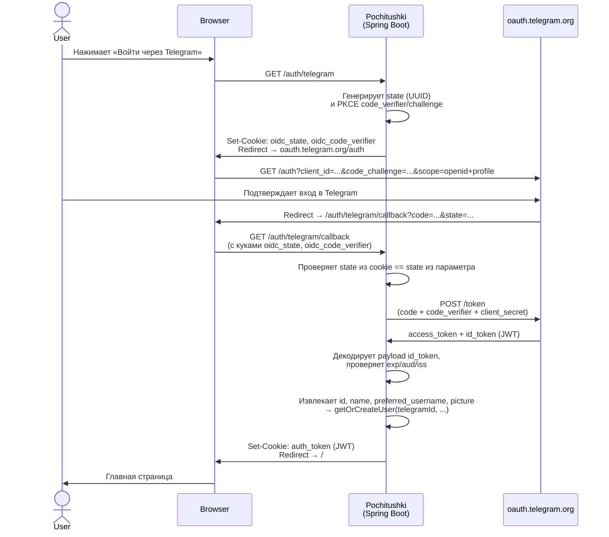
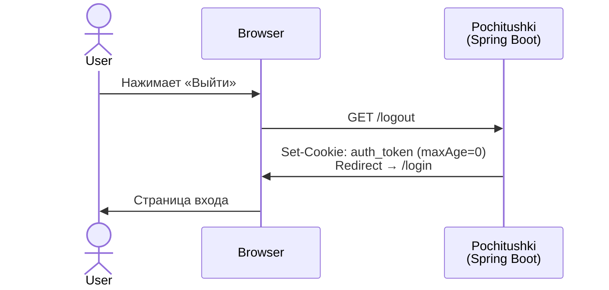
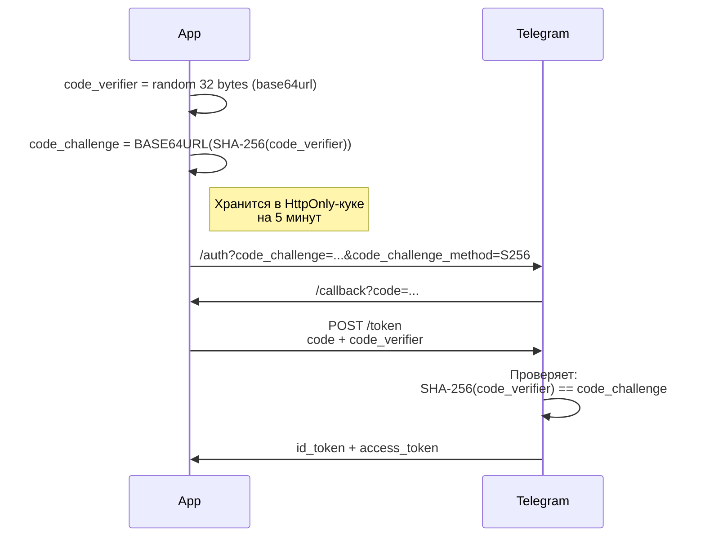

# Pochitushki Service

[](https://github.com/proshik/pochitushki/actions/workflows/build.yml)
[](https://github.com/proshik/pochitushki/actions/workflows/release.yml)
[](https://github.com/proshik/pochitushki/releases/latest)
[](https://github.com/proshik/pochitushki/pkgs/container/pochitushki)
[](https://github.com/proshik/pochitushki/commits)

[](https://kotlinlang.org)
[](https://spring.io/projects/spring-boot)
[](https://adoptium.net)
[](https://www.postgresql.org)
[](LICENSE)

Сервис «отложенного чтения» (read-it-later), аналог Pocket. Ссылки можно сохранять
и читать двумя способами: через **Telegram-бота** и через **веб-интерфейс** со
входом по Telegram-аккаунту. Оба интерфейса работают с одними и теми же данными.

## Основные возможности

- **Сохранение ссылок**: отправьте ссылку боту или добавьте её на веб-странице.
- **Лента и разделы**: непрочитанное, все ссылки, архив, избранное.
- **Архивация**: убирайте прочитанное в архив и возвращайте обратно.
- **Избранное**: отмечайте ссылки звёздочкой.
- **Удаление**: удаляйте ненужные ссылки.
- **Случайная ссылка**: получите случайную ссылку из списка для чтения.
- **PDF**: сохраняйте статью по ссылке в PDF (доступно из бота).
- **Импорт из Pocket**: загрузите ZIP-архив с экспортом из Pocket.
- **Экспорт**: выгрузите свои данные ZIP-архивом с CSV внутри (доступно из бота).
- **Два языка интерфейса**: русский и английский. Начальный язык берётся из
  Telegram, потом его можно сменить в профиле (бот или веб).

### Команды бота

| Команда | Действие |
|---|---|
| `/start` | Регистрация и приветствие |
| `/help` | Справка |
| `/feed` | Лента непрочитанных ссылок |
| `/random_post` | Случайная ссылка |
| `/archive` | Архив |
| `/favorites` | Избранное |
| `/profile` | Профиль и настройки |

Ссылка, отправленная боту обычным сообщением, сохраняется автоматически.

### Веб-интерфейс

Страницы на Thymeleaf: лента (`/`), все ссылки (`/all`), архив (`/archive`),
избранное (`/favorites`), профиль (`/profile`), вход (`/login`).

Динамика страниц работает через htmx поверх REST API `/api/v1` (аутентификация
той же JWT-кукой): добавление, архивация, избранное, удаление постов и настройки
профиля. Импорт и экспорт по HTTP не выставлены — только через бота.

## Требования

- JDK 25 (версия задана toolchain'ом в `build.gradle.kts`)
- PostgreSQL 16
- Telegram OAuth-приложение и, если нужен бот, токен бота

## Конфигурация

| Переменная | Обязательна | Назначение |
|---|---|---|
| `TELEGRAM_CLIENT_ID` | да | Client ID Telegram OAuth-приложения |
| `TELEGRAM_CLIENT_SECRET` | да | Client secret того же приложения |
| `APP_BASE_URL` | да | Базовый URL сервиса, из него собирается redirect-uri колбэка |
| `JWT_SECRET` | да | Ключ подписи JWT: base64, минимум 32 байта. Дефолта нет — без него приложение не стартует |
| `TELEGRAM_TOKEN` | да, если бот включён | Токен бота. При `TELEGRAM_ENABLED=false` не нужен |
| `TELEGRAM_ENABLED` | нет | Запускать ли бота (polling/webhook). По умолчанию `true`. Вход в веб через Telegram работает независимо от этого флага |
| `TELEGRAM_WEBHOOK_SECRET` | нет | Сверяется с заголовком `X-Telegram-Bot-Api-Secret-Token`. В проде задавать |
| `TELEGRAM_OAUTH_BASE_URL` | нет | База OIDC-провайдера, по умолчанию `https://oauth.telegram.org`. Меняется на брокер входа для локальной разработки |
| `TELEGRAM_EXPECTED_ISSUER` | нет | Ожидаемый `iss` в `id_token`, сверяется побайтово. По умолчанию `https://oauth.telegram.org`. Меняется **вместе** с базой и никогда из неё не выводится |
| `COOKIE_SECURE` | нет | Флаг `Secure` на куках, по умолчанию `true`. Локально по http нужен `false` |

Параметры БД по умолчанию — `localhost:5432/pochitushki`, `postgres/postgres`.
Переопределяются стандартными переменными Spring: `SPRING_DATASOURCE_URL`,
`SPRING_DATASOURCE_USERNAME`, `SPRING_DATASOURCE_PASSWORD`.

Сгенерировать `JWT_SECRET`:

```bash
openssl rand -base64 32
```

## Локальный запуск

Зависимости — PostgreSQL и брокер входа — поднимаются одной командой:

```bash
cp .env.dev.example .env.dev      # поправить BROKER_REGISTRY_KEY и свой Telegram ID
docker build -t telegram-login-broker:dev ../telegram-login-broker
docker compose -f compose.dev.yaml --env-file .env.dev up -d
```

Схема БД применяется автоматически через Liquibase при старте. Приложение
запускается **на хосте, не в compose** — и это не вкусовщина:
`telegram.oauth.base-url` нужен и браузеру для редиректа, и Feign для
server-to-server вызова, а внутри compose эти адреса разъезжаются
(`http://broker:8080` недостижим из браузера, `http://localhost:8090` — из
контейнера). Одного URL, работающего для обоих, там не существует.

```bash
set -a; . ./.env.dev; set +a
export JWT_SECRET="$(openssl rand -base64 32)"
export TELEGRAM_ENABLED=false   # поднять только веб, без бота

./gradlew bootRun
```

Приложение будет доступно на `http://localhost:8080`, вход — через брокер в
mock-режиме: он покажет список тестовых личностей вместо настоящего Telegram.

### Зачем брокер

Telegram принимает только публично-резолвимые HTTPS-адреса, поэтому вход через
него локально не проверялся и приложение запускали без аутентификации.
[telegram-login-broker](../telegram-login-broker) — постоянный публичный адрес,
который регистрируется в BotFather один раз и дальше сам редиректит браузер на
любой локальный порт. Про новые проекты и порты Telegram не узнаёт ничего.

Подключение — две переменные, которые меняются вместе (см. `.env.dev.example`).
`iss` сверяется побайтово, поэтому одной правки мало, и подсунуть брокер
приложению, которое под него не настроено, нельзя.

### Без брокера, против настоящего Telegram

```bash
export TELEGRAM_CLIENT_ID=... TELEGRAM_CLIENT_SECRET=...   # BotFather → Login Widget
export APP_BASE_URL=https://<публичный-адрес>
```

`redirect_uri` собирается как `$APP_BASE_URL/auth/telegram/callback` и должен
быть в Allowed URLs бота. `COOKIE_SECURE` при этом остаётся `true`.

## Сборка и тесты

```bash
./gradlew build      # сборка с тестами
./gradlew test       # тесты (PostgreSQL поднимается через TestContainers, нужен Docker)
./gradlew bootJar    # собрать исполняемый JAR
```

## Docker

Compose-файла в репозитории нет — только `Dockerfile`. PostgreSQL поднимается отдельно
(см. «Локальный запуск»).

```bash
docker build -t pochitushki .

docker run -p 8080:8080 \
  -e SPRING_DATASOURCE_URL=jdbc:postgresql://host.docker.internal:5432/pochitushki \
  -e JWT_SECRET="$(openssl rand -base64 32)" \
  -e TELEGRAM_CLIENT_ID=... \
  -e TELEGRAM_CLIENT_SECRET=... \
  -e APP_BASE_URL=http://localhost:8080 \
  -e TELEGRAM_ENABLED=false \
  pochitushki
```

PDF генерируется на чистом JVM-движке OpenHTMLToPDF, поэтому Chromium в образ не
входит. Чтобы собрать образ с Playwright-движком и включить его:

```bash
docker build --build-arg INSTALL_PLAYWRIGHT=true -t pochitushki .
docker run ... -e PDF_PLAYWRIGHT_ENABLED=true pochitushki
```

Build-arg лишь кладёт Chromium в образ; сам движок регистрируется только при
`pdf.playwright.enabled=true` (по умолчанию `false`).

Готовые образы публикуются в [GHCR](https://github.com/proshik/pochitushki/pkgs/container/pochitushki).

## Аутентификация через Telegram (OIDC + PKCE)

Веб-интерфейс использует Telegram Login через стандартный OAuth 2.0 / OIDC Authorization Code Flow с PKCE.
Данные пользователя извлекаются из `id_token` JWT — отдельного UserInfo-endpoint у Telegram нет.

### Общий флоу входа



### Структура id_token

Telegram возвращает JWT со следующими claim'ами (при scope `openid profile`):

| Claim | Тип | Обязателен | Описание |
|---|---|---|---|
| `id` | Number \| String | да | Telegram User ID. Задокументирован на `core.telegram.org/widgets/login`, но в `claims_supported` дискавери-документа его нет |
| `sub` | String | нет | Внутренний OIDC subject — **другое число**, не Telegram ID |
| `name` | String | нет | Полное имя пользователя |
| `preferred_username` | String? | нет | Telegram username (@handle) |
| `picture` | String? | нет | URL аватара |
| `iss` | String | да | Побайтово равен `telegram.oauth.expected-issuer` |
| `aud` | String \| Array | да | Содержит `client_id` приложения |
| `exp` | Number | да | Не истёк |
| `iat` | Number | нет | Если есть — не из будущего, допуск 60 с |

> **О верификации:** подпись `id_token` не проверяется осознанно — токен получен
> от token-эндпоинта по TLS в server-to-server запросе, транспорт гарантирует
> целостность. JWKS у Telegram при этом **есть**
> (`oauth.telegram.org/.well-known/jwks.json`), так что проверять подпись можно и
> это был бы более сильный ответ; то, что мы этого не делаем, — решение, а не
> отсутствие возможности.
>
> Именно поэтому проверки claim'ов — несущие, а не defense-in-depth, и каждая
> **обязательна**. Проверять claim «только если он присутствует» значит отдать
> решение тому, кто выпустил токен.
>
> `iss` сверяется побайтово с настраиваемым значением, а не проверяется на
> вхождение подстроки «telegram»: под подстроку подходит любой хост, который её
> содержит, и не подходит ни один честный не-телеграмный issuer. `aud`
> разбирается и как строка, и как массив — как `as? String` массив давал `null`
> и проверка молча отключалась. При отсутствии `id` вход падает, и `sub` **не**
> подставляется: это другое число, и подстановка выдала бы стабильную,
> правдоподобную и чужую личность.

### Флоу выхода



JWT stateless, поэтому logout не отзывает уже выданный токен — он лишь удаляет куку.
Срок жизни токена ограничен параметром `jwt.ttl-days` (по умолчанию 1 день).

### PKCE (защита от перехвата кода)



## Технологии

Kotlin 2.4 · Spring Boot 3.5 · Java 25 · PostgreSQL 16 · Spring JDBC (без ORM) ·
Liquibase · Thymeleaf · kotlin-telegram-bot · JJWT · OpenHTMLToPDF / Playwright ·
TestContainers

## Лицензия

[MIT](LICENSE)
